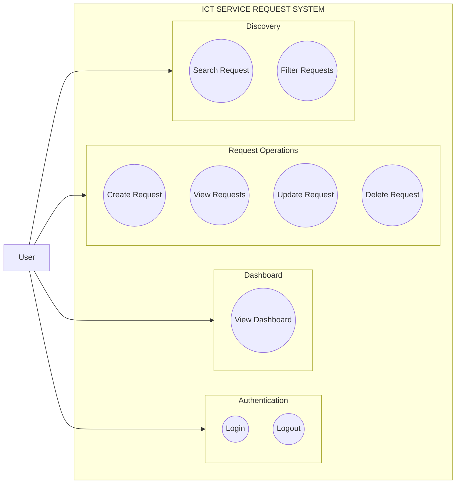
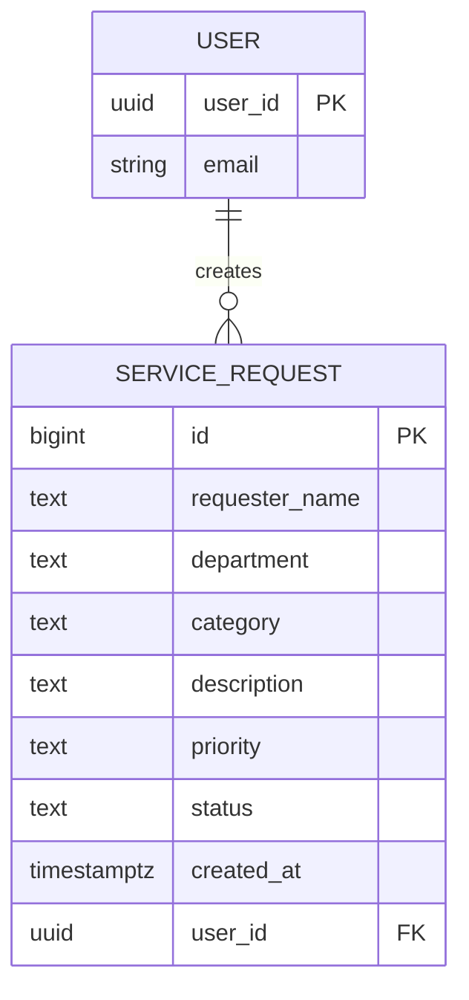

# ICT Service Request System

## Submission Information

Student: ELDRIX JOHN BEBIS
Section: BSIS-3A

## Supabase

Supabase REST API:
https://supabase.com/dashboard/project/myomxjcldharbgajmwwb

## GitHub Repository
GitHub Repository: https://github.com/drixjohn2856-bit/SAD_Service_Request_Bebis

## Live System
Live System: https://drixjohn2856-bit.github.io/SAD_Service_Request_Bebis/

## Test Account
Test Account: student@gmail.com
Test Password: TestPassword123


## Project Overview

This project is an online service request management system for a university ICT office. It allows authenticated users to submit, view, update, search, filter, and delete ICT support requests through a web interface powered by GitHub Pages and Supabase.

## Problem Statement

The university currently has no centralized system for recording and monitoring ICT support requests. Requests are handled through informal channels, which leads to missed issues, duplicate entries, and poor tracking of service status. A structured service request system is needed to improve efficiency, accountability, and response handling.

## Database Setup

```sql
CREATE TABLE service_requests (
    id BIGINT GENERATED BY DEFAULT AS IDENTITY PRIMARY KEY,
    requester_name TEXT NOT NULL,
    department TEXT NOT NULL,
    category TEXT NOT NULL,
    description TEXT NOT NULL,
    priority TEXT NOT NULL,
    status TEXT DEFAULT 'Pending',
    created_at TIMESTAMPTZ DEFAULT NOW(),
    user_id UUID REFERENCES auth.users(id)
);

ALTER TABLE service_requests ENABLE ROW LEVEL SECURITY;

CREATE POLICY "Authenticated users can view requests"
ON service_requests
FOR SELECT
TO authenticated
USING (true);

CREATE POLICY "Authenticated users can insert requests"
ON service_requests
FOR INSERT
TO authenticated
WITH CHECK (auth.uid() = user_id);

CREATE POLICY "Authenticated users can update requests"
ON service_requests
FOR UPDATE
TO authenticated
USING (auth.uid() = user_id);

CREATE POLICY "Authenticated users can delete requests"
ON service_requests
FOR DELETE
TO authenticated
USING (auth.uid() = user_id);
```

## Screenshots

## System Screenshots

### Login Page


### Dashboard


### Create Request Form


### Delete/Edit Workflow


## Deployment

The project is expected to be deployed using GitHub Pages with the repository configured under:
- Settings → Pages → Build and deployment
- Branch: main
- Folder: /(root)

## Project Structure

```text
sad-service-request/
├── index.html
├── login.html
├── css/
│   └── style.css
├── js/
│   ├── app.js
│   ├── auth.js
│   └── supabase.js
├── documentation/
│   └── system-analysis.md
├── README.md
└── .gitignore
```
# System Analysis

## System Title

ICT Service Request System

## Purpose

The system provides a single platform for university users to submit and manage ICT service requests. It helps users report technical issues, track the status of requests, and allows authorized staff to update or remove outdated information efficiently.

## 1. Problem Statement

The university currently has no centralized system for recording and monitoring ICT support requests. Users may submit requests through informal channels, which causes delays, poor tracking, missing information, and difficulty in managing service priorities and completion status. A structured service request system is needed to improve efficiency, accountability, and response handling.

## 2. Actors

- **Primary Actor:** System User / ICT Personnel

## 3. Use Case Diagram



## XVI. Simple ERD



The `USER` entity represents the authenticated user account, while each `SERVICE_REQUEST` belongs to one user and is created by that user.

## XVII. Requirements Traceability Matrix

| Req. ID | Requirement | System Feature | Test |
| --- | --- | --- | --- |
| FR-01 | User can log in | Login Page | TC-01 |
| FR-02 | User can create request | Request Form | TC-02 |
| FR-03 | User can view requests | Request Table | TC-03 |
| FR-04 | User can update request | Edit Function | TC-04 |
| FR-05 | User can delete request | Delete Function | TC-05 |
| FR-06 | User can search | Search Function | TC-06 |
| FR-07 | User can filter | Filter Function | TC-07 |
| FR-08 | System displays summaries | Dashboard | TC-08 |

This matrix shows that each system feature is directly linked to an identified requirement and a test case. It demonstrates that the application was designed based on defined user needs rather than ad hoc development.

## Non-functional Requirements

 Responsive layout for desktop and mobile browsers.
 Supabase Row Level Security should be enabled before production use.
 Publishable/anon credentials may be used in browser code; service-role credentials must never be exposed.
