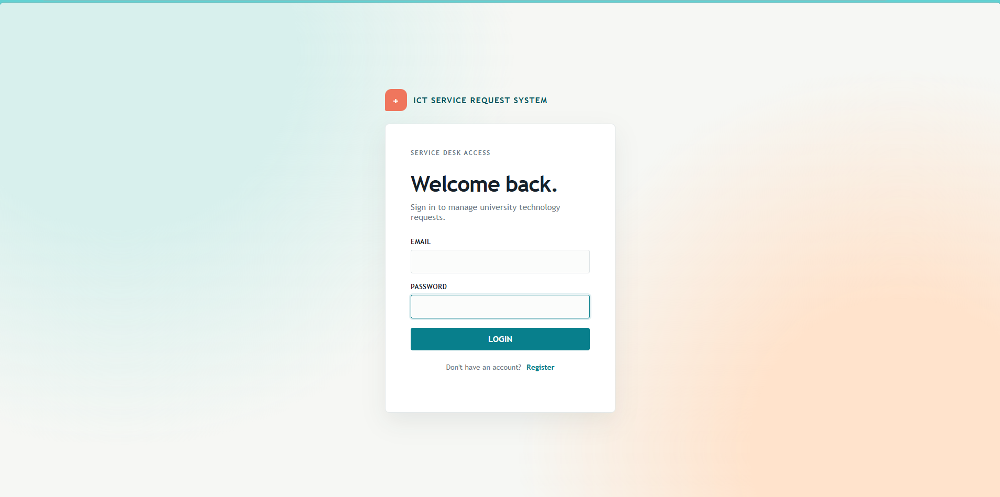
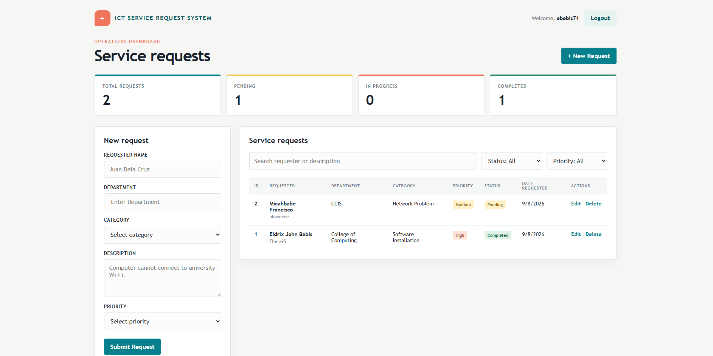
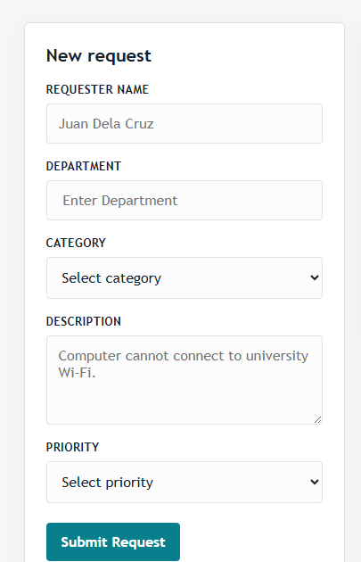
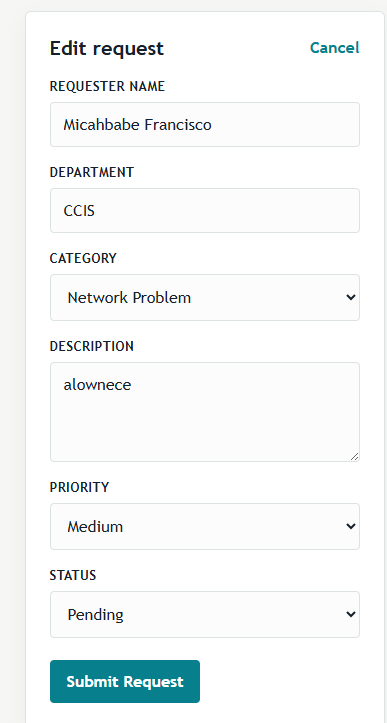

# ICT Service Request System

## Submission Information

Student: ELDRIX JOHN BEBIS
Section: BSIS-3A

## Supabase

Supabase REST API:
https://myomxjcldharbgajmwwb.supabase.co/rest/v1/

## GitHub Repository
GitHub Repository: https://github.com/drixjohn2856-bit/SAD_Service_Request_Bebis

## Live System
Live System: https://drixjohn2856-bit.github.io/SAD_Service_Request_Bebis/

## Test Account
Test Account: student@gmail.com
Test Password: TestPassword123


## Project Overview

This project is an online service request management system for a university ICT office. It allows authenticated users to submit, view, update, search, filter, and delete ICT support requests through a web interface powered by GitHub Pages and Supabase.

## Problem Statement

The university currently has no centralized system for recording and monitoring ICT support requests. Requests are handled through informal channels, which leads to missed issues, duplicate entries, and poor tracking of service status. A structured service request system is needed to improve efficiency, accountability, and response handling.

## Database Setup

```sql
CREATE TABLE service_requests (
    id BIGINT GENERATED BY DEFAULT AS IDENTITY PRIMARY KEY,
    requester_name TEXT NOT NULL,
    department TEXT NOT NULL,
    category TEXT NOT NULL,
    description TEXT NOT NULL,
    priority TEXT NOT NULL,
    status TEXT DEFAULT 'Pending',
    created_at TIMESTAMPTZ DEFAULT NOW(),
    user_id UUID REFERENCES auth.users(id)
);

ALTER TABLE service_requests ENABLE ROW LEVEL SECURITY;

CREATE POLICY "Authenticated users can view requests"
ON service_requests
FOR SELECT
TO authenticated
USING (true);

CREATE POLICY "Authenticated users can insert requests"
ON service_requests
FOR INSERT
TO authenticated
WITH CHECK (auth.uid() = user_id);

CREATE POLICY "Authenticated users can update requests"
ON service_requests
FOR UPDATE
TO authenticated
USING (auth.uid() = user_id);

CREATE POLICY "Authenticated users can delete requests"
ON service_requests
FOR DELETE
TO authenticated
USING (auth.uid() = user_id);
```

## Screenshots

## System Screenshots

### Login Page


### Dashboard


### Create Request Form


### Delete/Edit Workflow



## Deployment

The project is expected to be deployed using GitHub Pages with the repository configured under:
- Settings → Pages → Build and deployment
- Branch: main
- Folder: /(root)

## Project Structure

```text
sad-service-request/
├── index.html
├── login.html
├── css/
│   └── style.css
├── js/
│   ├── app.js
│   ├── auth.js
│   └── supabase.js
├── documentation/
│   └── system-analysis.md
├── README.md
└── .gitignore
```
