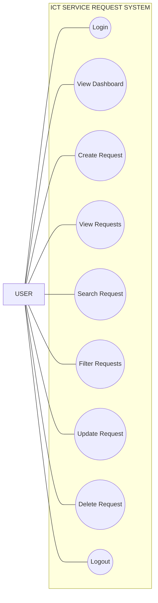
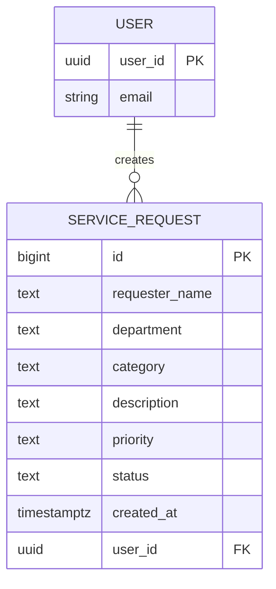

# System Analysis

## System Title

ICT Service Request System

## Purpose

The system provides a single platform for university users to submit and manage ICT service requests. It helps users report technical issues, track the status of requests, and allows authorized staff to update or remove outdated information efficiently.

## 1. Problem Statement

The university currently has no centralized system for recording and monitoring ICT support requests. Users may submit requests through informal channels, which causes delays, poor tracking, missing information, and difficulty in managing service priorities and completion status. A structured service request system is needed to improve efficiency, accountability, and response handling.

## 2. Actors

- **Primary Actor:** System User / ICT Personnel

## 3. Use Case Diagram

## XVI. Simple ERD

The `USER` entity represents the authenticated user account, while each `SERVICE_REQUEST` belongs to one user and is created by that user.

## XVII. Requirements Traceability Matrix

| Req. ID | Requirement | System Feature | Test |
| --- | --- | --- | --- |
| FR-01 | User can log in | Login Page | TC-01 |
| FR-02 | User can create request | Request Form | TC-02 |
| FR-03 | User can view requests | Request Table | TC-03 |
| FR-04 | User can update request | Edit Function | TC-04 |
| FR-05 | User can delete request | Delete Function | TC-05 |
| FR-06 | User can search | Search Function | TC-06 |
| FR-07 | User can filter | Filter Function | TC-07 |
| FR-08 | System displays summaries | Dashboard | TC-08 |

This matrix shows that each system feature is directly linked to an identified requirement and a test case. It demonstrates that the application was designed based on defined user needs rather than ad hoc development.

## Non-functional Requirements

 Responsive layout for desktop and mobile browsers.
 Supabase Row Level Security should be enabled before production use.
 Publishable/anon credentials may be used in browser code; service-role credentials must never be exposed.
