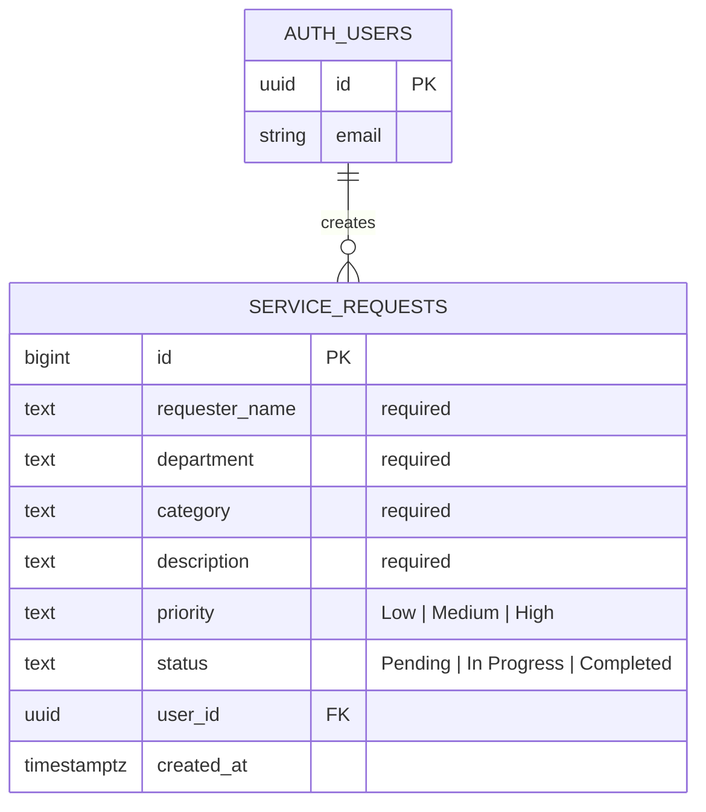

# System Analysis

## System Title

ICT Service Request System

## Purpose

The system gives university users a single place to submit and track ICT support requests. Authorized users can manage request details while support staff can update progress and completion status.

## Users

- **Requester:** signs in and submits a service request.
- **ICT staff:** reviews requests, updates status, edits request details, and deletes invalid or obsolete records.

## Core Data

Each service request stores the requester name, department, category, description, priority, status, owning user, and creation date.

## Entity Relationship Diagram

`AUTH_USERS` represents Supabase Authentication's built-in `auth.users` table. Each authenticated user can create zero or more service requests, while every service request belongs to one authenticated user through `user_id`.

## Business Rules

- **BR-01:** Requester name is required.
- **BR-02:** Department is required.
- **BR-03:** Category is required.
- **BR-04:** Description is required.
- **BR-05:** Priority must be Low, Medium, or High.
- **BR-06:** New requests automatically receive Pending status.
- **BR-07:** Status can be changed only while editing an existing request.
- **BR-08:** Delete requires confirmation.
- **BR-09:** The dashboard requires an authenticated Supabase session.

## Main Workflows

1. A user signs in with email and password.
2. The dashboard loads requests ordered by newest first.
3. The user submits a validated request; Supabase stores it with Pending status.
4. Users search by requester or description and combine status and priority filters.
5. An existing request can be edited, including its status.
6. A confirmed delete removes a request and refreshes the dashboard.
7. Logout ends the Supabase session and returns the user to the login page.

## Non-functional Requirements

- Responsive layout for desktop and mobile browsers.
- Supabase Row Level Security should be enabled before production use.
- Publishable/anon credentials may be used in browser code; service-role credentials must never be exposed.
